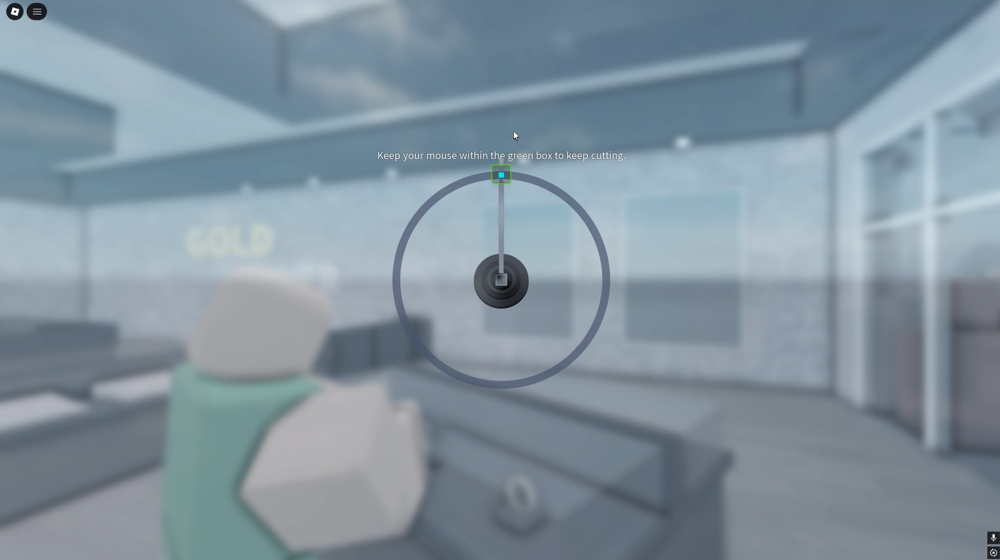

<div align="center">

# Jewelry Auto Rob


Created for [**ER:LC**](https://www.roblox.com/games/2534724415/Emergency-Response-Liberty-County)

</div>

## 🚀 About
**Jewelry Auto Rob** is NOT a cheat.              
This is a Python script that moves your mouse around the center of the screen, automating the jewelry store robbery in ER:LC.  
GUI will be added soon.

## 📋 Requirements
- Python 3.x

## ⚙️ Usage
1. Install [Python 3.x](https://www.python.org/downloads/)
2. Download script. 
3. Customize script for your monitor resolution
    * ```center_x = 2560 /2```  
    2560 replace to your resolution as x
    * ```center_y = 1440 /2```  
    1440 replace to your resolution as y
    * Save changes
3. Open Roblox
4. Enter the game
    * Go to the jewelry store and rob one of the tables
    * DO NOT move your cursor to the green box before starting the script
5. Activate the script
    * Start the script in explorer
    * You have 3 seconds to enter the Roblox game
    * Wait for completion
6. Done!

## 📸 Examples of Use
<p align="center" width="100%">

</p>


<h2 align="center">📞 Support</h2>
<table align="center">
  <tr align="center">
    <td>
      <br>
    </td>
    <td>
      <br>
    </td>
    <td>
      <br>
    </td>
  </tr>
  <tr align="center">
    <td>
      <a href="https://discord.com/users/programmduck">Click</a><br>
    </td>
    <td>
      <a href="https://t.me/programmduck">Click</a><br>
    </td>
    <td>
      <a href="mailto:ProgrammDuck@yandex.ru">Write</a>
    </td>
  </tr>
  <tr align="center">
    <td>
      ProgrammDuck
    </td>
    <td>
      @ProgrammDuck
    </td>
    <td>
      ProgrammDuck@yandex.ru
    </td>
  </tr>
</table>
