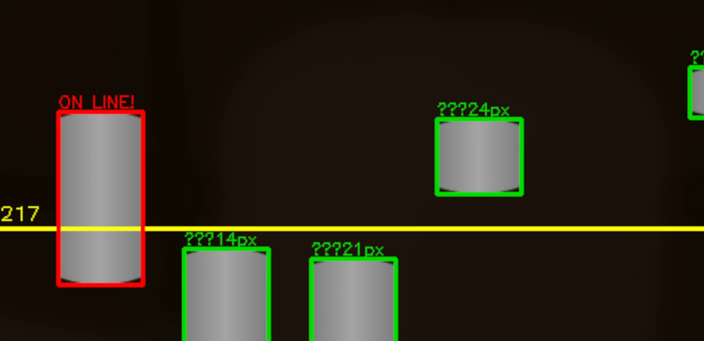

# ER:LC Jewelry/House auto rob

Created for [**ER:LC**](https://www.roblox.com/games/2534724415/Emergency-Response-Liberty-County)

## 🚀 About
**ER:LC Jewelry/House auto rob** is NOT a cheat.              
This is a Python script that moves your mouse around the center of the screen, automating the jewelry store or house robbery in ER:LC.  
GUI will be added soon.

## 📋 Requirements
- Python 3.x
- opencv-python 
- numpy 
- mss 
- keyboard

## ⚙️ Usage
1. Install [Python 3.x](https://www.python.org/downloads/) ([3.14](https://www.python.org/downloads/release/python-3143/) is optimal)
2. Download script
3. Install requirements
   * `pip install -r requirements.txt`
4. Customize `config.json` for your monitor resolution
    * `"CAPTURE_REGION": [995, 564, 569, 337]` for 2k monitors
    * `"CAPTURE_REGION": [676, 380, 567, 346]` for default monitors (FullHD)
    * Save changes
    * [There's no my screen resolution here](https://youtu.be/jSoLQPH3cCk)
5. Change the keybinds in `config.json`
6. Open Roblox
7. Enter the game
8. Activate the script
    * Start the `Start nowindows.bat` or `Start.bat` in explorer
    * As default **F5 To rob a jewelry**, **F6 to rob a house**, **F8 for stop scripts**
    * **Do not** mess script in active.
9. Done!

## 📸 Examples of Use
- https://youtu.be/fBIddWWB1FY

<h2 align="center">📞 Support</h2>
<table align="center">
  <tr align="center">
    <td>
       
    </td>
    <td>
       
    </td>
    <td>
       
    </td>
  </tr>
  <tr align="center">
    <td>
      <a href="https://discord.com/users/programmduck">Click</a> 
    </td>
    <td>
      <a href="https://t.me/programmduck">Click</a> 
    </td>
    <td>
      <a href="mailto:ProgrammDuck@yandex.ru">Write</a>
    </td>
  </tr>
  <tr align="center">
    <td>
      ProgrammDuck
    </td>
    <td>
      @ProgrammDuck
    </td>
    <td>
      ProgrammDuck@yandex.ru
    </td>
  </tr>
</table>
